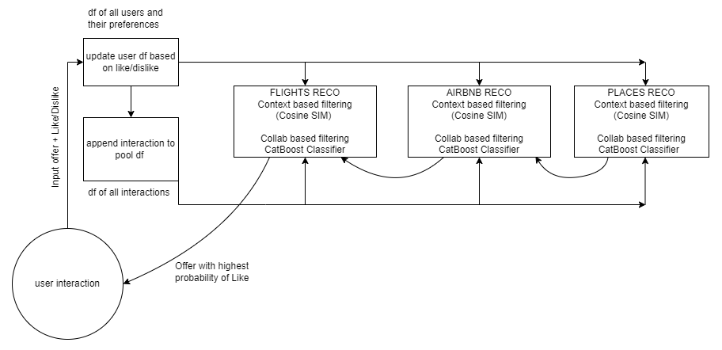

# Introduction

Travel planning can be a time-consuming and overwhelming process, especially when trying to find the best flights, accommodations, and activities tailored to individual preferences. The Travel Full Package Recommendation System addresses this challenge by offering users personalized suggestions for flights, Airbnb accommodations, and places to visit in a destination city. The system uses a combination of content-based and collaborative filtering methods, considering users' preferences, past choices, and similarities with other users. This document provides a detailed description of the project's implementation, the algorithms used, data processing, and future plans for merging the content-based and collaborative filtering approaches.

# System Overview

The recommendation system consists of three main components: flight recommendations, Airbnb recommendations, and places to visit recommendations. These components are merged to generate a single recommendation for the user. The system begins by obtaining the user's location and recommending a flight based on their preferences. Once the destination city is determined, the system proceeds to suggest Airbnb accommodations and places to visit in the city. The final output includes a flight to a specific city, Airbnb accommodation, and a place to visit within that city.

# Data Preparation

A crucial step in the implementation of the recommendation system is data preparation. The data sources include flight database, Airbnb listings database, and places to visit database. At first the basic approaches to clean the data have been done: handling missing values, removing duplicates, and removing irrelevant features from the data. Then, feature extraction was done by adding new features to the data frame that are useful to get comparison between different data so that we could compute cosine similarity.
# Content-based Filtering

The content-based filtering approach uses cosine similarity to find the most similar data for recommendations. This method considers users' preferences, such as preferred cities, price ranges, and other attributes, to generate suggestions. Each recommendation affects the user's preference profile. If the user likes a recommendation, then the preference score for the attributes of that recommendation is increased and if the user dislikes it then the preference score for the attributes of that recommendation is decreased. The data is stored in a data frame and updated each time the user likes or dislikes the recommended package. And this dynamic profile is used to generate future recommendations.

## Flight Recommendations

For flight recommendations, the system considers factors such as departure time, price range, and destination city. Cosine similarity is used to compare the user's preferences with available flight options, and the most suitable flight is recommended. If the user likes the flight, the preference score for the relevant attributes is increased; if they dislike the flight, the score is decreased.

## Airbnb Recommendations

The Airbnb recommendation component uses a similar approach, with cosine similarity applied to the descriptions of the accommodation. Factors such as the number of beds, amenities, and location are considered in the recommendation process. The user's reaction to a suggested Airbnb affects their preference profile accordingly.

## Places Recommendations

The places to visit recommendation component also employs cosine similarity, using descriptions of the attractions and the user's preferences to generate recommendations. The system considers categories of the place such as beaches, nature, historical sites, and other best times to visit the place in a day such as morning, afternoon, or night to offer personalized suggestions. The user's preference profile is updated based on their reaction to the recommended places.

# Collaborative Filtering

In addition to content-based filtering, a collaborative filtering approach is implemented using a CatBoost model. The system stores user data in a data frame and identifies similar users to make recommendations based on their preferences. The collaborative filtering model is not yet integrated with the content-based approach but will be combined in future enhancements. The collaborative filtering model considers the users' preferences and their interactions with the system to determine which users have similar tastes. This information is then used to recommend travel packages that similar users have liked.

## User Similarity

The system computes user similarity by considering users' preferences, their interaction history, and other attributes stored in a single data frame for all the users to determine which users are most similar. The choice of similarity metric can affect the quality of the recommendations, so it is essential to select the most suitable method for the specific dataset and use case.

### CatBoost Model

The CatBoost model is a gradient boosting algorithm that is particularly well-suited for handling categorical features, making it an excellent choice for the collaborative filtering approach in the Travel Full Package Recommendation System. The model is trained on the user data to predict users' preferences for flights, accommodations, and places to visit. The model is trained to calculate the probability of a user liking a particular recommendation based on similar users’ preferences. The trained model is then used to generate personalized recommendations for each user based on their similarities with other users.

# Future Enhancements

The current system outputs a single recommendation based on content-based filtering. Future enhancements will involve merging content-based and collaborative filtering approaches by generating a ranked list of recommendations from the content-based filtering method and using the collaborative filtering model to select the final recommendation. This hybrid approach aims to provide a more accurate and personalized travel package for users.

# Improved Integration

To further enhance the system's performance, efforts will be made to improve the integration of the content-based and collaborative filtering approaches. This may include refining the algorithms, adjusting the similarity metrics, and experimenting with different model configurations to achieve the best possible results.

# Conclusion

The Travel Full Package Recommendation System offers users a personalized and efficient way to plan their travels. Combining content-based and collaborative filtering methods allows the system to cater to individual preferences and improve recommendations over time. By implementing the enhancements discussed in this document, the recommendation system will continue to evolve and provide an even more accurate and tailored travel experience for users.

# How To Use

There are two main files to run:
recommend.py
Allows the user to interact with the system by taking input from the user: current location of the user and outputs the recommended travel package.
record.py
Updates the user data frame based on the user’s reaction to the recommended package.

# Additional Documents

Link to google drive for two .npy files which includes the cosine similarities are mentioned below. They were too large to upload on github therefore we are providing the link to the google drive to download it. 

https://drive.google.com/file/d/1GmjODU2qadh0xjvw4q-U2W2et4m6h5Lo/view?usp=sharing

https://drive.google.com/file/d/1GHiUXZbuEw_4tH04qU2opIaPnpdi4LCB/view?usp=sharing

Link to the google drive for large data files that should be in data_files folder:
https://drive.google.com/drive/folders/17590S3_hFGSbgloRXh-uGs6CNQbKDDXa
